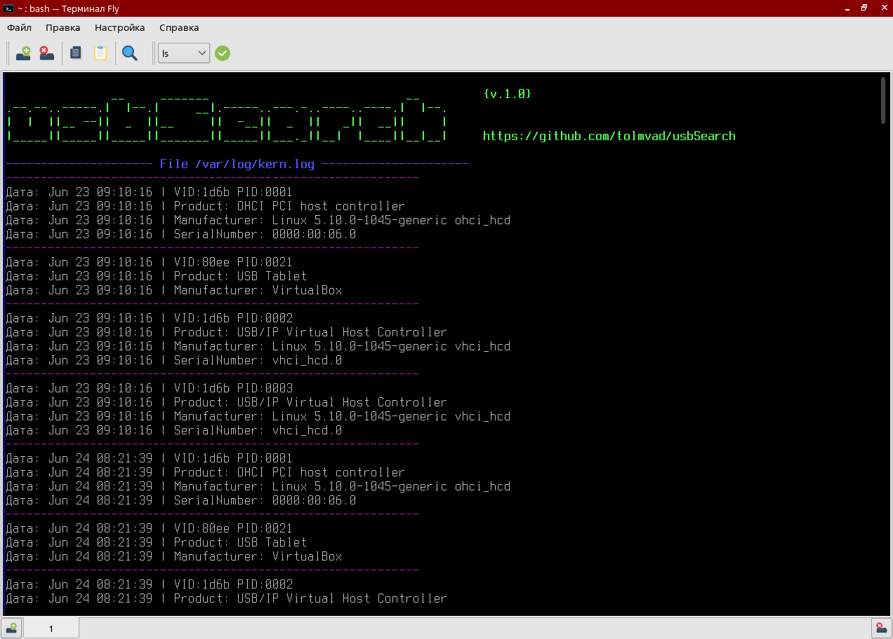
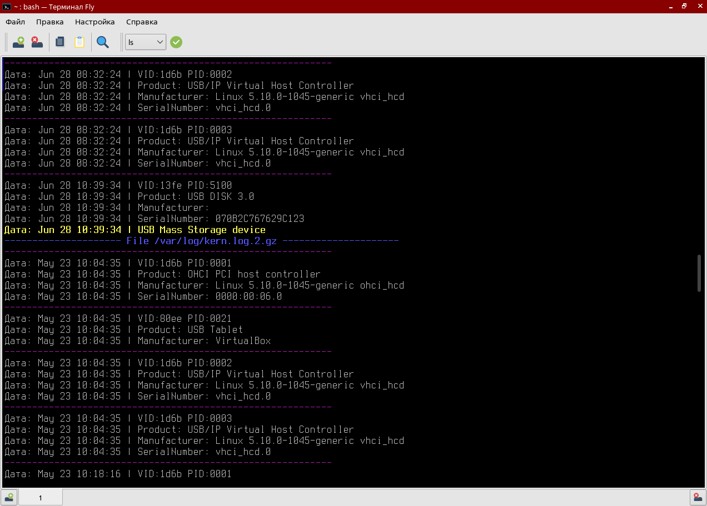

<p align="center">
  <a href="#"></a>
</p>

**usbSearch** - это простой инструмент позволяющий посмотреть историю подключенных USB-устройств к ПК под управлением ОС AstraLinux.


* [**Описание**](#Описание)
* [**Ограничения**](#Ограничения)
* [**Внешний вид**](#Внешний-вид)
* [**Как использовать**](#Как-использовать)
* [**Дополнительно**](#Дополнительно)
  - [*Отсутствуют права на исполнение*](#Отсутствуют-права-на-исполнение)
  - [*Как узнать версию OC Astralinux*](#Как-узнать-версию-OC-Astralinux)
  - [*Как узнать в какой группе состоите*](#Как-узнать-в-какой-группе-состоите)
  - [*Сохранение в фаил*](#Сохранение-в-фаил)
  - [*Уничтожение логов*](#Уничтожение-логов)


----------

## Описание
**usbSearch** - небольшой bash-script, который анализирует данные журнала OC `AstraLinux`. После чего выводит следующие данные в терминал:
- **File** - фаил в котором происходит поиск
- **Дата** - дата и время подключения
- **VID** (Vendor ID) - идентификатор вендора
- **PID** (Product ID) - идентификатор продукта
- **Product** - продукт
- **Manufacturer** - изготовитель
- **SerialNumber** - серийный номер
- **USB Mass Storage device** - если USB-накопитель

## Ограничения
- **usbSearch** предназначена исключительно для ОС `AstraLinux`.
Протестирована на: `AstraLinux SE 1.6`, `AstraLinux SE 1.7.1`, `AstraLinux CE 2.12.44`.
- **usbSearch** необходимо запускать из под пользователя с группой `astra-admin`,`sudo` или `root`.
- **usbSearch** полностью зависит от лог-файлов ОС `AstraLinux`, поэтому не может отображать всю картину ранее подключенных USB-накопителей, т.к. лог-файлы перезаписываются.

## Внешний вид


## Как использовать
1) Скачиваем и переносим на компьютер c ОС AstraLinux исполняемый файл `usbSearch.sh`
2) Переходим открываем терминал и запускаем скрипт:
```bash
~$ sudo ./usbSearch.sh
```
3) Искомые USB-носители будут иметь дополнительную строчку подсвеченную желтым светом:



## Дополнительно
#### Отсутствуют права на исполнение

Вероятно у вас не будет прав для исполнения скрипта и это можно проверить следующим путём. В папке с файлом `usbSearch.sh` открываем терминал и вводим `ls -l`:

```bash
~$ ls -l
...
-rw-r--r-- 1 user group 1720 date time usbSearch.sh
...
```

Если в первой тройки `rwx` будет отсутствовать флаг `x` на исполнение файла, нужно будет ввести следующую команду:

```bash
~$ chmod 744 usbSearch.sh
```
И снова проверить модификаторы доступа к файлу:
```bash
~$ ls -l
...
-rwxr--r-- 1 user group 1720 date time usbSearch.sh
...
```
В таком случае можно будет запустить скрипт.

#### Как узнать версию OC Astralinux
Ввести в терминал команду `cat /etc/astra_version`:
```bash
~$ cat /etc/astra_version
1.7.1
```

#### Как узнать в какой группе состоите
Вариант 1. Ввести в терминал команду `groups`:
```bash
~$ groups
useradm cdrom floppy audio dip video plugdev netdev lpadmin scanner astra-console astra-admin
```

Вариант 2. Ввести в терминал команду `id`:
```bash
~$ id
uid=1001(user1) gid=1002(user1) группы=1002(user1),20(dialout),24(cdrom),25(floppy),27(sudo),29(audio),44(video),46(plugdev),100(users)
```

#### Сохранение в фаил
При запуске скрипта нудно будет дописать `> фаил`:
```bash
~$ sudo ./usbSearch.sh > usb.txt
```
Весь вывод программы будет перенаправлен в фаил `usb.txt` (если файла с таким названием нет, то он будет создан; если файл с таким названием существует, он будет перезаписан). Фактически это позволит провести анализ позднее.

#### Уничтожение логов
Чтобы не забивать лишнее место в памяти лог-файлы периодически сжимаются и удаляются.
В `AstraLinux` за это отвечает утилита `Logrotate`.
Некоторые настройки по умолчанию содержатся в `/etc/logrotate.conf`.
Но в нашем случае нужен фаил `/etc/logrotate.d/syslog-ng`, в нем описываются правила ротации логов, на котором основана работа скрипта.
Пример:
```bash
~$ cat /etc/logrotate.d/syslog-ng
/var/log/syslog
{
        rotate 7
        daily
        ...
}
...
...
/var/log/kern.log
/var/log/messages
{
        rotate 4
        weekly
        ...
}
```
`rotate` - указывает на кол-во журналов которые будут храниться (не считая текущий)
`daily`, `weekly`, `monthly` - как часто обновлять лог фаил (день, неделя, месяц)

Этой информации будет достаточно, чтобы понять как долго хранятся логи.
