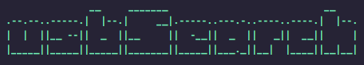

<p align="center">
  <a href="#"></a>
</p>

**usbSearch** - это простой инструмент позволяющий посмотреть историю подключенных USB-устройств к ПК под управлением ОС AstraLinux.

----------

### Описание
**usbSearch** - небольшой bash-script, который анализирует данные журнала AstraLinux (`/var/log/kern.log`). После чего выводит следующие данные в терминал:
- **File** - фаил в котором проиходит поиск
- **Дата** - дата и время подключения
- **VID** (Vendor ID) - идентификатор вендора
- **PID** (Product ID) - идентификатор продукта
- **Product** - продукт
- **Manufacturer** - изготовитель
- **SerialNumber** - серийный номер
- **USB Mass Storage device** - если USB-накопитель

### Ограничения
- **usbSearch** предназначена исключительно для ОС `AstraLinux`.
Протестирована на: `AstraLinux SE 1.6`, `AstraLinux SE 1.7.1`, `AstraLinux CE 2.12.44`.
- **usbSearch** необходимо запускать из под пользователя с группой `astra-admin`,`sudo` или `root`.
- **usbSearch** полностью зависит от лог-файлов ОС `AstraLinux`, поэтому не может отображать всю картину ранее подключенных USB-накопителей, т.к. лог-файлы перезаписыватся.

### Внешний вид


### Как использовать
1) Скачиваем и переносим на компьютер c ОС AstraLinux исполняемый файл `usbSearch.sh`
2) Переходим открываем терминал и запускаем скрипт:
```bash
~$ sudo ./usbSearch.sh
```
3) Искомые USB-носители будут иметь дополнительную строчку подсвеченную желтым светом:


